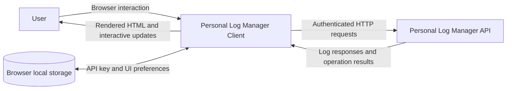
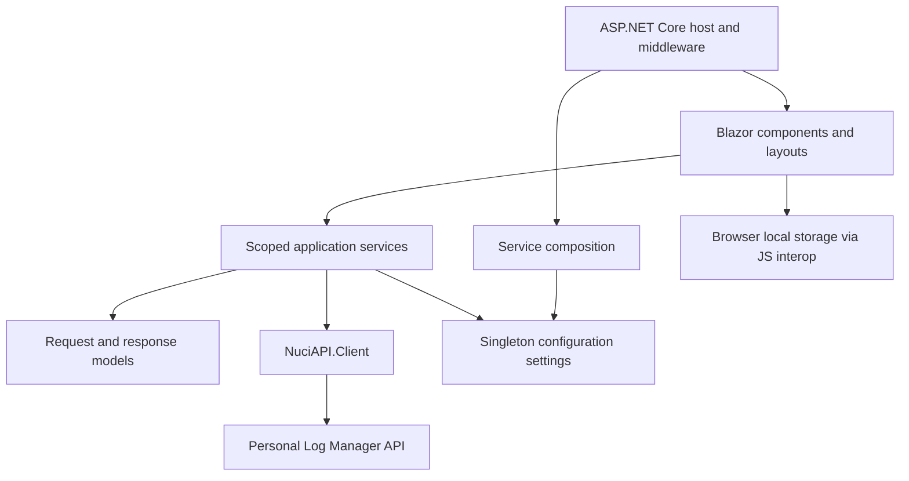
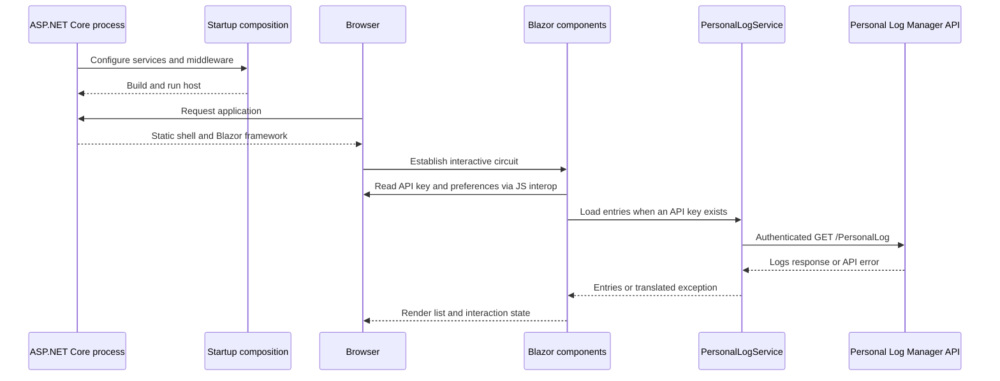
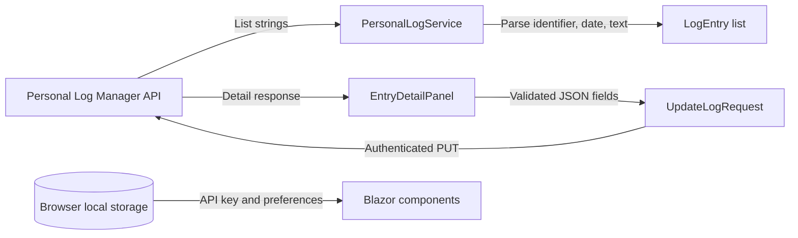
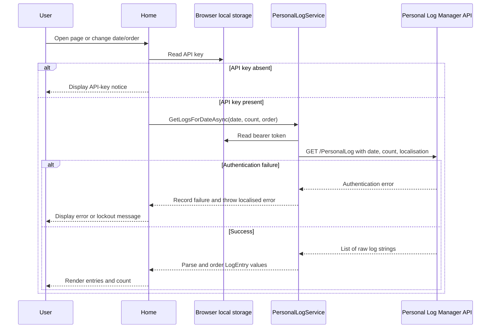
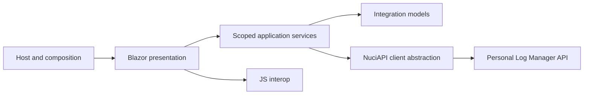

# Personal Log Manager Client Architecture

This document describes the current architecture of the Personal Log Manager Client, a .NET 10 Blazor Server application that presents and mutates personal log entries through the Personal Log Manager API. It covers the client process, browser interaction, integration boundary, state ownership, and operational constraints; it does not describe the upstream API implementation.

## 📑 Table of Contents

- [Purpose](#-purpose)
- [System Context](#-system-context)
- [Architectural Style](#-architectural-style)
- [Runtime Flow](#-runtime-flow)
- [Components](#-components)
- [Architectural Areas](#-architectural-areas)
  - [Host And Composition](#host-and-composition)
  - [Presentation And Interaction](#presentation-and-interaction)
  - [Integration And Models](#integration-and-models)
- [Data Architecture](#-data-architecture)
- [Interfaces And Integrations](#-interfaces-and-integrations)
- [Key Flows](#-key-flows)
  - [Browse Entries](#browse-entries)
  - [Edit Or Delete An Entry](#edit-or-delete-an-entry)
- [Cross-Cutting Concerns](#-cross-cutting-concerns)
  - [Security And Privacy](#security-and-privacy)
  - [Error Handling](#error-handling)
  - [Configuration](#configuration)
  - [Concurrency And Resource Use](#concurrency-and-resource-use)
- [Dependency Direction And Rules](#-dependency-direction-and-rules)
- [External Dependencies](#-external-dependencies)
- [Deployment And Operations](#-deployment-and-operations)
- [Compatibility Contracts](#-compatibility-contracts)
- [Testing And Verification](#-testing-and-verification)
- [Design Constraints](#-design-constraints)
- [Extension Points](#-extension-points)
  - [API Client Boundary](#api-client-boundary)
- [Source Map](#-source-map)
- [Related Documentation](#-related-documentation)

## 🎯 Purpose

The system's principal responsibility is to provide an interactive browser client for browsing, inspecting, editing, and deleting personal log entries exposed by the Personal Log Manager API. This document is intended for contributors and maintainers who need to locate ownership, follow request and state flows, and assess the impact of changes. It records the implemented current architecture rather than a target design.

## 🌐 System Context

The client is a single ASP.NET Core web process. A user's browser loads the application and maintains an interactive Blazor Server circuit. The client reads an API key and presentation preferences from browser local storage, sends authenticated requests to the configured Personal Log Manager API, and renders the returned log data. The upstream API owns the authoritative log records; the client has no server-side database or file persistence for those records.



The principal external boundaries are:
- **Browser:** Hosts the interactive Blazor Server circuit and stores the API key, sort preference, and full-width preference in local storage.
- **Personal Log Manager API:** Owns log data and receives authenticated read, update, and delete requests from the client through `NuciAPI.Client`.
- **Deployment environment:** Supplies the process network, configured API base URL, and optional path base; it is outside the client application's state ownership.

## 🏗️ Architectural Style

The application is a server-hosted interactive web client with a component-based Blazor presentation layer and a small service façade over an outbound HTTP API. ASP.NET Core composes the host and middleware, Blazor maps UI components and maintains interactive circuits, and `PersonalLogService` translates UI operations into API requests and responses. Configuration is bound once into singleton settings, while UI and API-facing services are scoped to the Blazor circuit.



The principal architecture boundaries are:
- **Host and composition:** Starts the process, binds configuration, registers services, enables static files, routing, antiforgery, and Razor components.
- **Presentation and interaction:** Owns routes, layouts, loading and selection state, JSON editing, localisation, and browser storage interaction.
- **Application service façade:** Owns API-key checks, rate-limit state, request construction, authentication metadata, response translation, and error conversion.
- **Integration models and transport:** Defines the request and response shapes exchanged with the upstream API through `NuciAPI.Client`.

## 🔄 Runtime Flow



The principal runtime sequence is:
1. `Program.Main` creates the web application builder, delegates service registration to `Startup`, builds the application, applies middleware, and runs the host.
2. The browser receives the Razor component shell and establishes an interactive server circuit.
3. The home page reads local storage state. When an API key exists, it invokes `PersonalLogService` to retrieve entries for the selected date.
4. The service creates authenticated requests through `INuciApiClient`, translates successful responses into client models, and exposes API failures as UI-visible exceptions.
5. The UI renders the result and can initiate detail retrieval, update, delete, date navigation, sorting, localisation, or preference changes.

## 🧩 Components

| Component | Responsibility | Principal Dependencies | Lifetime or Ownership |
|-----------|----------------|------------------------|-----------------------|
| `Program` and `Startup` | Host startup, middleware, component mapping, and service registration | ASP.NET Core, configuration | Process entry point; host-owned |
| `App` and `Routes` | HTML shell, base URI, routing, and interactive server render mode | `ServerSettings`, Blazor components | Application component tree |
| `Home` and `MainLayout` | Main list workflow, navigation, selection, layout, title, and localisation events | Scoped services, JS interop, child components | Scoped to the interactive circuit |
| `EntryDetailPanel` | Detail retrieval, JSON presentation/editing, update, delete, and confirmation state | `PersonalLogService`, `LocaleService` | Component-owned transient UI state |
| `PersonalLogService` | API façade, authentication metadata, response mapping, and API failure handling | `INuciApiClient`, `ApiKeyService`, `ApiKeyRateLimitService`, `LocaleService` | Scoped per circuit |
| `ApiKeyService` | Reads, writes, and clears the API key in browser local storage | `IJSRuntime` | Scoped per circuit; browser storage owns persistence |
| `ApiKeyRateLimitService` | Tracks failed authentication attempts and circuit-local lockout | .NET time and collections | Scoped per circuit |
| `LocaleService` and `PageTitleService` | Localisation selection and title notification | Localisation resources, component event handlers | Scoped per circuit |
| `INuciApiClient` | Sends requests to the configured upstream API | `NuciAPI.Client`, `PersonalLogManagerSettings` | Scoped per circuit |

## 🗂️ Architectural Areas

### Host And Composition

Paths:
- [`Program.cs`](Program.cs)
- [`Startup.cs`](Startup.cs)
- [`ServiceCollectionExtensions.cs`](ServiceCollectionExtensions.cs)
- [`Configuration/`](Configuration/)
- [`App.razor`](App.razor)
- [`Routes.razor`](Routes.razor)

Responsibilities:
- Create and run the ASP.NET Core host.
- Bind `server` and `personalLogManager` configuration sections.
- Register singleton settings and scoped application services.
- Configure path base, static content types, routing, antiforgery, and interactive server rendering.

Boundary rules:
- Composition owns registration and infrastructure setup; feature components consume registered services rather than constructing them.
- Configuration values are passed through settings objects; the API service does not read configuration files directly.

### Presentation And Interaction

Paths:
- [`Pages/`](Pages/)
- [`Layout/`](Layout/)
- [`Services/LocaleService.cs`](Services/LocaleService.cs)
- [`Services/LocalisationStrings.cs`](Services/LocalisationStrings.cs)
- [`Services/PageTitleService.cs`](Services/PageTitleService.cs)
- [`wwwroot/`](wwwroot/)

Responsibilities:
- Render the list, detail panel, navigation controls, API-key input, localisation selector, and application layout.
- Own transient loading, selection, edit, confirmation, and error display state.
- Invoke browser local storage through JavaScript interop for API keys and UI preferences.

Boundary rules:
- Components delegate remote log operations to `PersonalLogService`.
- Presentation state is not treated as authoritative log storage.

### Integration And Models

Paths:
- [`Services/PersonalLogService.cs`](Services/PersonalLogService.cs)
- [`Models/`](Models/)

Responsibilities:
- Define request and response shapes for list, detail, update, and delete operations.
- Construct authenticated API calls and map raw list strings into `LogEntry` records.
- Translate recognised authentication failures into localised errors and lockout state.

Boundary rules:
- Upstream API contracts are represented in the models and service façade rather than spread through UI components.
- JSON edit data is parsed and validated at the detail-panel boundary before an update request is sent.

## 💾 Data Architecture

The client does not own durable log-record persistence. The upstream API is the source of truth. The client transforms list response strings into `LogEntry` values, retrieves detailed JSON-shaped records on selection, and serialises edited date, time, time-zone, and data fields into an update request.



| Data or Store | Owner | Representation and Storage | Lifecycle or Consistency |
|---------------|-------|----------------------------|--------------------------|
| Log records | Personal Log Manager API | Remote API responses; list records are strings and details are JSON response models | Authoritative outside this repository; mutations are sent synchronously through API calls |
| `LogEntry` list | `PersonalLogService` and `Home` | In-memory `List<LogEntry>` scoped to the active component circuit | Replaced after date, sort, edit, delete, or localisation reload |
| API key | Browser and `ApiKeyService` | Browser `localStorage` under `plm_api_key` | Persists until cleared by the user; transmitted as a bearer token when requests execute |
| UI preferences | Browser and `Home` | Browser `localStorage` under `sortAscending` and `fullWidth` | Persists across browser sessions and affects presentation only |
| Authentication failures | `ApiKeyRateLimitService` | Scoped in-memory failure timestamps and lock expiry | Five failures within ten minutes produce a thirty-minute circuit-local lockout |

## 🔌 Interfaces And Integrations

| Interface or Integration | Direction | Contract | Owner | Failure Semantics |
|--------------------------|-----------|----------|-------|-------------------|
| Blazor Server circuit | Inbound and outbound | ASP.NET Core Razor components and interactive server render mode | ASP.NET Core and Blazor | Circuit or component errors are surfaced by the UI; no application-level retry policy is defined |
| Personal Log Manager API | Outbound | `GET /PersonalLog`, `GET /PersonalLog/{id}`, `PUT /PersonalLog/{id}`, and `DELETE /PersonalLog/{id}` with bearer authentication | `PersonalLogService` and `NuciAPI.Client` | Recognised authentication errors increment the lockout tracker and become localised exceptions; other responses fall through the client response handling |
| Browser local storage | Bidirectional | JavaScript interop keys `plm_api_key`, `sortAscending`, and `fullWidth` | `ApiKeyService` and presentation components | Storage access failures propagate through the component operation; no server-side substitute exists |
| Static asset delivery | Outbound to browser | ASP.NET Core static files, including configured font MIME mappings | `Startup` | Missing assets are handled by the web server's static-file pipeline |

## 🔀 Key Flows

### Browse Entries



`Home` owns the selected date, ordering, loading flag, and list state. `PersonalLogService` owns request construction and raw-to-model conversion. A missing API key prevents the request; recognised authentication failures are recorded before the error is displayed.

### Edit Or Delete An Entry

```mermaid
sequenceDiagram
    participant User
    participant Panel as EntryDetailPanel
    participant Service as PersonalLogService
    participant API as Personal Log Manager API
    participant Home

    User->>Panel: Select entry
    Panel->>Service: GetLogByIdAsync(id)
    Service->>API: GET /PersonalLog/{id}
    API-->>Panel: Detailed response
    alt Edit
        User->>Panel: Modify JSON and save
        Panel->>Panel: Parse JSON and require data object
        Panel->>Service: UpdateLogAsync(id, date, time, timeZone, data)
        Service->>API: PUT /PersonalLog/{id}
        API-->>Service: Success or error
        Service-->>Panel: Complete or throw
        Panel->>Home: Notify edited; reload list
    else Delete
        User->>Panel: Confirm deletion
        Panel->>Service: DeleteLogAsync(id)
        Service->>API: DELETE /PersonalLog/{id}
        API-->>Service: Success or error
        Service-->>Panel: Complete or throw
        Panel->>Home: Notify deleted; reload list
    end
```

The detail panel owns edit and delete confirmation state. JSON parsing and the required `data` property are validated before an update is dispatched. Successful mutations close the panel and cause `Home` to reload the current date; failures remain local to the panel for display.

## 🧵 Cross-Cutting Concerns

### Security And Privacy

The browser supplies the API key through a password input and `ApiKeyService` stores it in browser local storage. `PersonalLogService` sends it as bearer authentication and includes a client identifier containing the machine name. The application enables ASP.NET Core antiforgery middleware for the interactive host. The client does not define API authorisation policy or own the upstream records; those responsibilities remain with the Personal Log Manager API. The architecture therefore treats browser storage, the configured API endpoint, and rendered log details as sensitive boundaries.

### Error Handling

UI operations catch exceptions at the component boundary and display their messages in the relevant page or panel. `PersonalLogService` recognises `AUTHENTICATION_FAILURE` and `UNAUTHORISED` responses, records the failure, and throws a localised invalid-key or lockout exception. Invalid edit JSON is rejected in `EntryDetailPanel` before transport. There is no repository-wide retry, circuit-breaker, or structured logging implementation evidenced in the source.

### Configuration

| Configuration Area | Source | Responsibility | Override or Secret Policy |
|--------------------|--------|----------------|---------------------------|
| `server.pathBase` | [`appsettings.json`](appsettings.json) and ASP.NET Core configuration providers | Sets the optional reverse-proxy path base and document base URI | Bound during startup; no secret is expected |
| `personalLogManager.baseUrl` | [`appsettings.json`](appsettings.json) and ASP.NET Core configuration providers | Selects the upstream API base URL used by `NuciApiClient` | Bound during startup; the repository example is local development configuration |
| API key | Browser local storage | Authenticates API requests | Entered at runtime; not stored in repository configuration |

### Concurrency And Resource Use

Blazor components and custom services are scoped to the interactive circuit. API operations are asynchronous and UI controls are disabled during selected loading, saving, or deleting operations. `ApiKeyRateLimitService` uses mutable in-memory state without cross-circuit coordination, so its lockout applies to the current service scope rather than constituting a process-wide rate limit. The list request defaults to a count of 1,000 records, and no pagination or backpressure mechanism is implemented in this client.

## 🧭 Dependency Direction And Rules

The host composes configuration and services; presentation components depend on scoped service abstractions and models; the application service façade depends on the API client, configuration, and browser/localisation collaborators; models depend on the `NuciAPI` request and response contracts. The upstream API is reached only through `PersonalLogService` and its injected `INuciApiClient` boundary.



The principal dependency rules are:
- Components use `PersonalLogService` for log operations and do not construct HTTP clients.
- Configuration is bound in the composition root and injected through settings objects.
- API transport and upstream response interpretation remain behind `PersonalLogService`.
- The client does not introduce a local database or duplicate upstream log ownership.

## 📦 External Dependencies

| Dependency | Responsibility | Integration Boundary | Architectural Consequence |
|------------|----------------|----------------------|---------------------------|
| ASP.NET Core and .NET 10 | Web hosting, middleware, dependency injection, configuration, and runtime | `Program.cs`, `Startup.cs`, and service registration | The process lifecycle and supported runtime follow the .NET 10 web stack |
| Blazor Server | Component rendering and interactive server circuits | `App.razor`, `Routes.razor`, and Razor components | Browser interaction depends on a live server circuit |
| `NuciAPI.Client` 1.2.3 | HTTP request/response transport and API contract base types | `INuciApiClient` registration and model inheritance | Upstream transport and base response semantics are coupled to this package |
| Personal Log Manager API | Authoritative personal log storage and operations | `PersonalLogService` routes and bearer authentication | Availability and API contract compatibility are external operational prerequisites |
| Browser JavaScript local storage | Client-side API-key and preference persistence | `IJSRuntime` calls | Storage is browser-scoped and has no server-side recovery path |

## 🚀 Deployment And Operations

The application is deployed as one .NET web process and serves the Blazor application, static assets, and interactive server circuits. It requires network access from the server process to the configured Personal Log Manager API. The repository's release script delegates to an external .NET 10 deployment script; the exact deployment infrastructure is outside this repository. No application database, server-side log-record store, or process-wide lockout store is configured here.

| Concern | Current Design | Architectural Consequence |
|---------|----------------|---------------------------|
| Process topology | Single ASP.NET Core web process with interactive server circuits | Horizontal scaling requires circuit affinity or an equivalent circuit strategy not defined here |
| API connectivity | Configured through `personalLogManager.baseUrl` | API availability and network configuration are required for log operations |
| Persistent application state | Browser local storage for API key and preferences; no server database | User state is browser-specific and is not recoverable from the server |
| Path hosting | Optional `server.pathBase` | Reverse-proxy deployments must preserve the configured base path in routing and asset URLs |
| Release mechanism | [`release.sh`](release.sh) invokes an external maintainer script | Release behaviour depends on an external script and network retrieval |

## 🛡️ Compatibility Contracts

| Contract | Owner | Invariant | Verification | Change Policy |
|----------|-------|-----------|--------------|---------------|
| Upstream log routes | `PersonalLogService` | Route shapes and HTTP verbs remain aligned with the Personal Log Manager API | Build plus integration or manual API verification | Coordinate changes with the upstream API before changing request construction |
| API request JSON | Models and `EntryDetailPanel` | Update payload contains `date`, `time`, `timeZone`, and `data`; delete payload contains `id` | Model inspection and API integration verification | Preserve field names or update both client and API contracts |
| Local storage keys | `ApiKeyService` and `Home` | `plm_api_key`, `sortAscending`, and `fullWidth` retain their meanings | Manual browser verification | Treat key names as persisted client data; migrate deliberately if changed |
| Path base and asset base | `ServerSettings` and `App.razor` | Configured path base is reflected in the document `<base>` URI and middleware | Run under a non-root path base and inspect navigation/assets | Update middleware and document-base logic together |
| Authentication lockout policy | `ApiKeyRateLimitService` | Five failures within ten minutes cause a thirty-minute scoped lockout | Manual or focused service test | Changes affect user access and must preserve clear failure messaging |

## ✅ Testing And Verification

No test project or automated test suite is present in the repository. The architecture-sensitive verification currently available is compilation and manual execution of the principal browser workflows: startup, API-key entry/clearing, date navigation, list retrieval, detail retrieval, JSON editing, deletion, localisation, and path-base hosting.

Execute the principal automated verification with:

```bash
dotnet build PersonalLogManagerClient.csproj
```

Integration verification against a running Personal Log Manager API and focused tests for rate limiting, request mapping, and component error states remain coverage gaps in the current repository.

## ⚠️ Design Constraints

- **Upstream ownership:** Log records remain authoritative in the Personal Log Manager API; the client cannot provide offline mutation or server-side recovery.
- **Circuit-scoped state:** Rate-limit state, list state, and service instances are scoped to interactive circuits, so they are not shared across users or processes.
- **Browser storage dependence:** API-key and preference persistence depends on browser local storage and JavaScript interop.
- **Live connection requirement:** Interactive server rendering requires an active connection to the host for normal interaction.
- **Unbounded detail editing:** The editor accepts arbitrary JSON data fields but requires valid JSON and a `data` object; semantic validation is delegated to the upstream API.
- **External release dependency:** The release script retrieves and executes a remote deployment script, coupling release operation to external network availability and script integrity.

## 🔧 Extension Points

### API Client Boundary

1. Implement or revise the owning contract through `INuciApiClient` or a compatible `NuciAPI.Client` implementation.
2. Register or integrate the implementation at the verified composition boundary in [`ServiceCollectionExtensions.cs`](ServiceCollectionExtensions.cs).
3. Add the verification required to preserve neighbouring contracts.

The extension must preserve asynchronous request semantics, bearer-authentication support, the configured base URL, and the request/response models consumed by `PersonalLogService`. New log operations should remain behind that service façade rather than being called directly from Razor components.

## 🗺️ Source Map

| Area | Path |
|------|------|
| Host and composition | [`Program.cs`](Program.cs), [`Startup.cs`](Startup.cs), [`ServiceCollectionExtensions.cs`](ServiceCollectionExtensions.cs) |
| Configuration | [`Configuration/`](Configuration/) and [`appsettings.json`](appsettings.json) |
| Presentation | [`App.razor`](App.razor), [`Routes.razor`](Routes.razor), [`Pages/`](Pages/), and [`Layout/`](Layout/) |
| Application services | [`Services/`](Services/) |
| API contracts | [`Models/`](Models/) |
| Static assets and PWA shell | [`wwwroot/`](wwwroot/) |
| Deployment | [`release.sh`](release.sh) and [`Properties/launchSettings.json`](Properties/launchSettings.json) |

## 📚 Related Documentation

- [`README.md`](README.md) documents usage, configuration, development commands, dependencies, and contribution guidance.
- [`SECURITY.md`](SECURITY.md) defines supported versions, vulnerability-reporting scope, and coordinated disclosure expectations.
- [`LICENSE`](LICENSE) defines the project's licensing terms.
