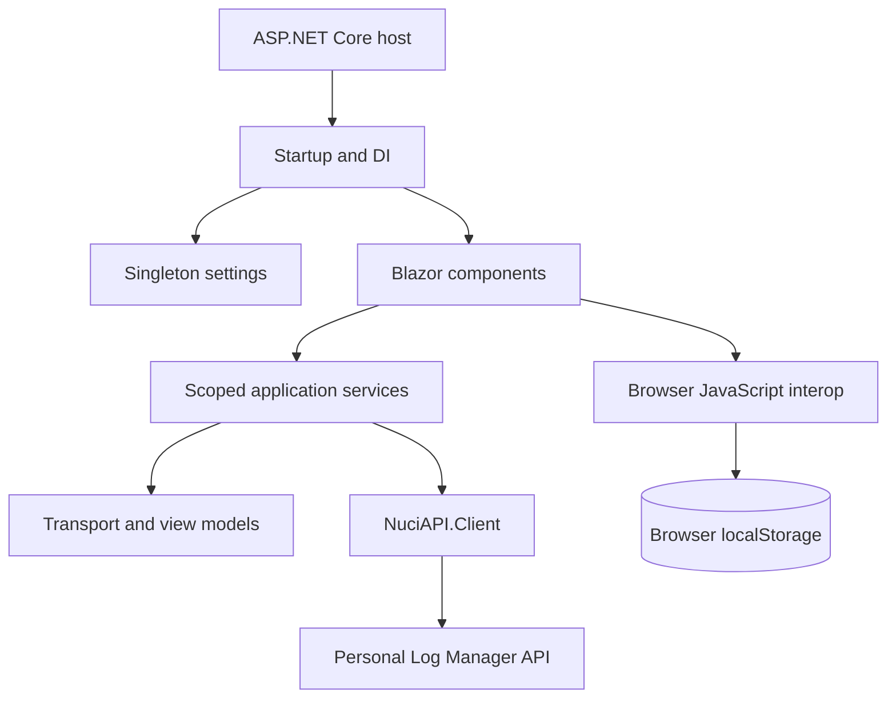
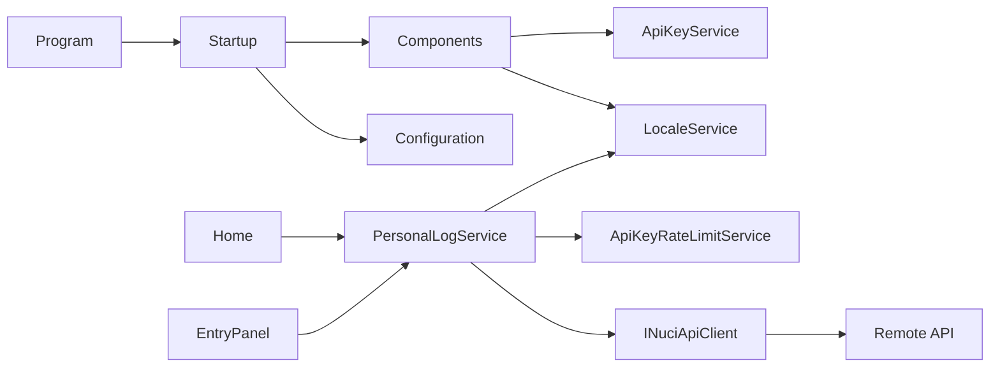
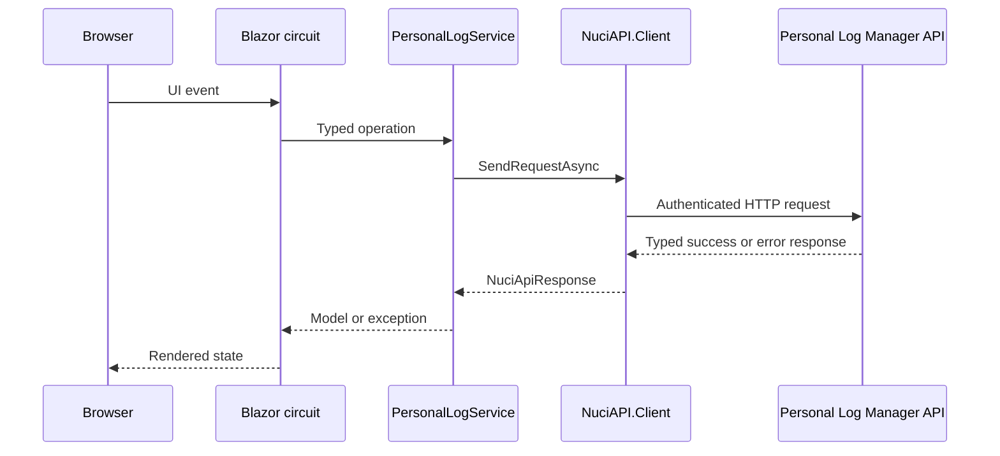

# Architecture

**Purpose:** Explain component ownership, dependency direction, composition, topology, and lifecycle.

**Scope:** Current .NET 10 Blazor Server implementation; upstream API internals are external.

**Primary source areas:** [Program.cs](../PersonalLogManager.Client/Program.cs), [Startup.cs](../PersonalLogManager.Client/Startup.cs), [ServiceCollectionExtensions.cs](../PersonalLogManager.Client/ServiceCollectionExtensions.cs), [App.razor](../PersonalLogManager.Client/App.razor), and [Routes.razor](../PersonalLogManager.Client/Routes.razor).

**Related documents:** [Repository overview](repository-overview.md), [component documents](components/), [flows](flows/), [State and persistence](state-and-persistence.md).

## Decomposition

### Host and composition

[Program](../PersonalLogManager.Client/Program.cs) is the process entry point. [Startup.ConfigureServices](../PersonalLogManager.Client/Startup.cs) adds Razor Components with interactive server support, binds settings, and registers custom services. [Startup.Configure](../PersonalLogManager.Client/Startup.cs) applies optional path base, static files, routing, antiforgery, and Razor component endpoint mapping.

Composition owns registration and middleware. It does not own log operations or presentation state.

### Presentation

[App.razor](../PersonalLogManager.Client/App.razor) supplies the HTML shell and base href. [Routes.razor](../PersonalLogManager.Client/Routes.razor) maps routes and applies [MainLayout](../PersonalLogManager.Client/Layout/MainLayout.razor). [Home](../PersonalLogManager.Client/Pages/Home.razor) owns list workflow state. [EntryDetailPanel](../PersonalLogManager.Client/Layout/EntryDetailPanel.razor) owns detail, edit, and delete state. Smaller layout components own API-key input, locale selection, date selection, and footer links.

Presentation consumes scoped services and models. It does not own authoritative log storage, API URL configuration, or transport client construction.

### Application façade

[PersonalLogService](../PersonalLogManager.Client/Services/PersonalLogService.cs) checks lockout, reads the API key, creates `NuciApiRequestAuthorisationInfo`, calls `INuciApiClient`, translates raw list strings into [LogEntry](../PersonalLogManager.Client/Models/LogEntry.cs), and converts recognised authentication failures into localised `InvalidOperationException` instances. It does not retry, persist records, or validate upstream business rules.

### Configuration and transport

[ServiceCollectionExtensions](../PersonalLogManager.Client/ServiceCollectionExtensions.cs) binds `ServerSettings` and `PersonalLogManagerSettings` as singletons and creates a scoped `NuciApiClient`. Models inherit from `NuciAPI.Requests.NuciApiRequest` or `NuciAPI.Responses.NuciApiSuccessResponse` where appropriate.

## Dependency direction

The host composes dependencies. Components call application services. `PersonalLogService` is the only repository-owned path to the remote log API. Browser storage is accessed directly by `ApiKeyService`, `LocaleService`, and selected UI components for preferences.

## Lifetimes and topology

- `ServerSettings` and `PersonalLogManagerSettings`: singleton settings objects.
- `INuciApiClient`, `ApiKeyService`, `ApiKeyRateLimitService`, `LocaleService`, `PageTitleService`, `PersonalLogService`: scoped, matching the interactive circuit.
- Component fields: transient state for a component instance.
- Browser local storage: persistent browser-side state, outside server memory.
- Remote log records: persistent upstream state, outside this process.

No explicit shutdown or disposal service exists. Components unsubscribe from locale or title events in `Dispose`; the host exits through normal ASP.NET Core process lifecycle.

## Request topology

## Initialisation

`Program.Main` creates the builder, calls `Startup.ConfigureServices`, builds the app, calls `Startup.Configure`, and runs. The browser receives the Razor shell with prerender disabled for the `Routes` interactive server render mode. `MainLayout`, `LocaleSelector`, `ApiKeyWidget`, and `Home` initialise their scoped state when component instances initialise.

See [Startup and rendering](flows/startup-and-rendering.md) for ordering and [Host and composition](components/host-and-composition.md) for registration details.
