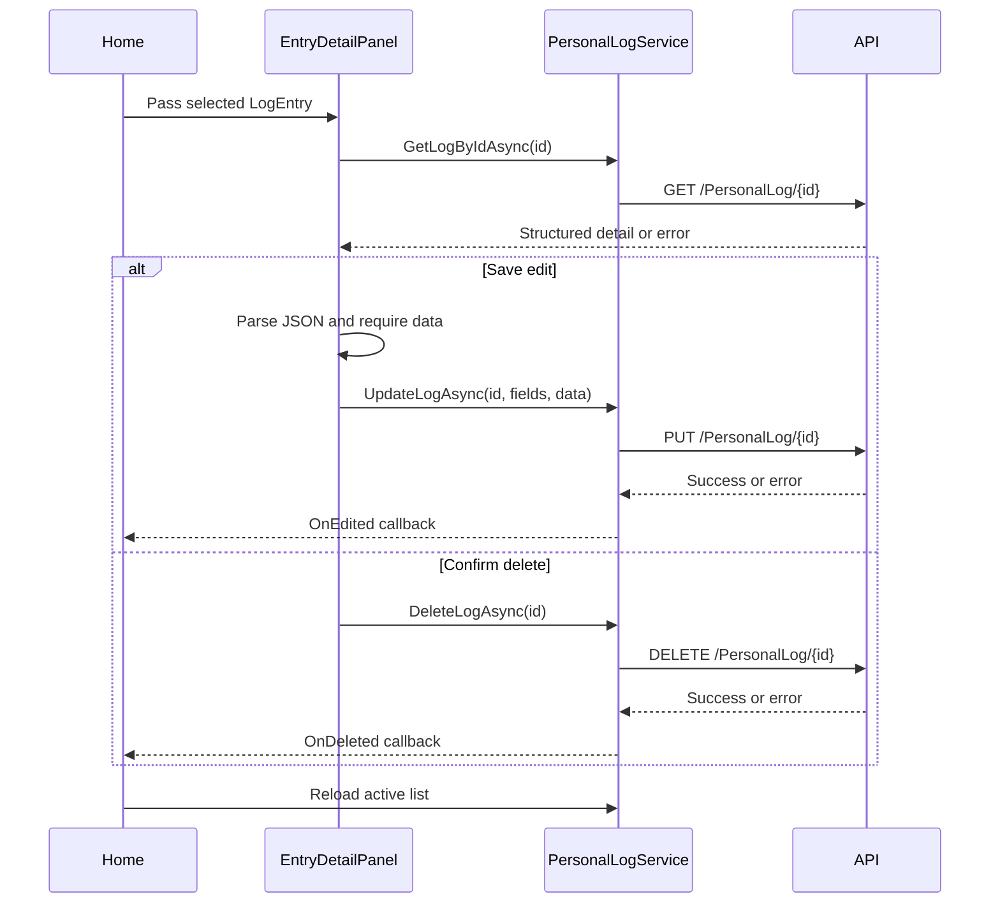

# Detail Mutation Flow

**Purpose:** Trace detail retrieval, JSON edit submission, and deletion confirmation.

**Scope:** [Home.razor](../../PersonalLogManager.Client/Pages/Home.razor), [EntryDetailPanel.razor](../../PersonalLogManager.Client/Layout/EntryDetailPanel.razor), and [PersonalLogService.cs](../../PersonalLogManager.Client/Services/PersonalLogService.cs).

**Primary source areas:** `SelectEntry`, `LoadEntryDetailsAsync`, `ExecuteEditAsync`, `ExecuteDeleteAsync`, and façade methods.

**Related documents:** [Inspect, edit, and delete](../behaviour/inspect-edit-delete.md), [Integration models](../components/integration-models.md), [Error handling](../error-handling.md).

The panel records independent load, edit, and delete error fields. Authentication errors are translated by the service; JSON parse and missing-data errors are generated locally. On success, the parent closes the panel and reloads the list, preserving the remote API as the source of truth.
