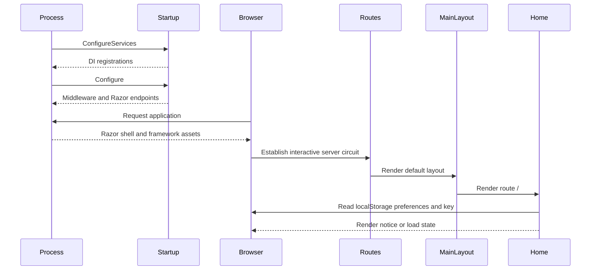

# Startup And Rendering Flow

**Purpose:** Trace process startup through interactive component rendering.

**Scope:** [Program.cs](../../PersonalLogManager.Client/Program.cs), [Startup.cs](../../PersonalLogManager.Client/Startup.cs), [App.razor](../../PersonalLogManager.Client/App.razor), [Routes.razor](../../PersonalLogManager.Client/Routes.razor), and layout components.

**Primary source areas:** `Program.Main`, `Startup.ConfigureServices`, `Startup.Configure`, and component lifecycle methods.

**Related documents:** [Host and composition](../components/host-and-composition.md), [Architecture](../architecture.md), [Configuration](../configuration.md).

## Sequence

1. `Program.Main` creates `WebApplicationBuilder` and registers Razor Components, settings, `NuciApiClient`, and scoped services.
2. The built app applies optional path base, static-file MIME mappings, routing, antiforgery, and Razor component endpoints.
3. `App.razor` sets the computed base href and uses `InteractiveServerRenderMode(prerender: false)` for `Routes`.
4. `Routes` maps `/` to `Home` under `MainLayout`; unknown routes use a not-found layout view.
5. `MainLayout` renders title, API-key widget, locale selector, routed body, and footer, subscribing to title changes.
6. `LocaleSelector` initialises locale storage. `ApiKeyWidget` checks API-key storage. `Home` reads sort and width preferences and the API key.
7. If no key exists, `Home` renders the notice and stops. If a key exists, it begins the active list request.

## Lifecycle boundaries

The circuit owns scoped service state. Component disposal removes event subscriptions in `Home`, `MainLayout`, `ApiKeyWidget`, and `AppFooter` where implemented. There is no explicit application shutdown callback or persistent server-side session store.
